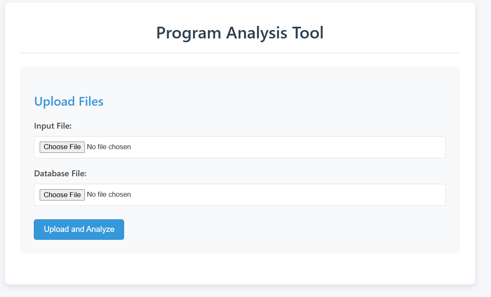
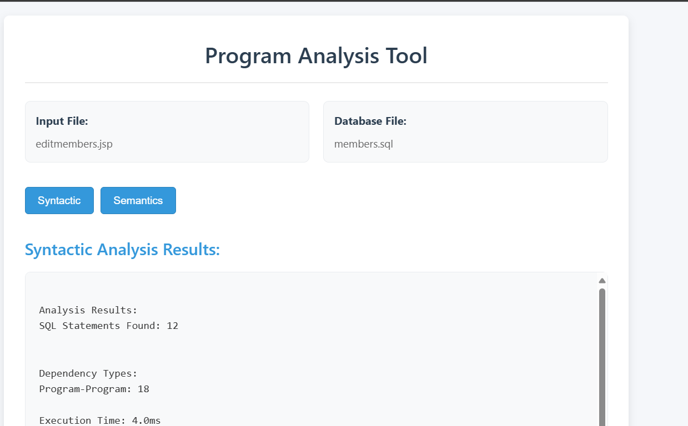
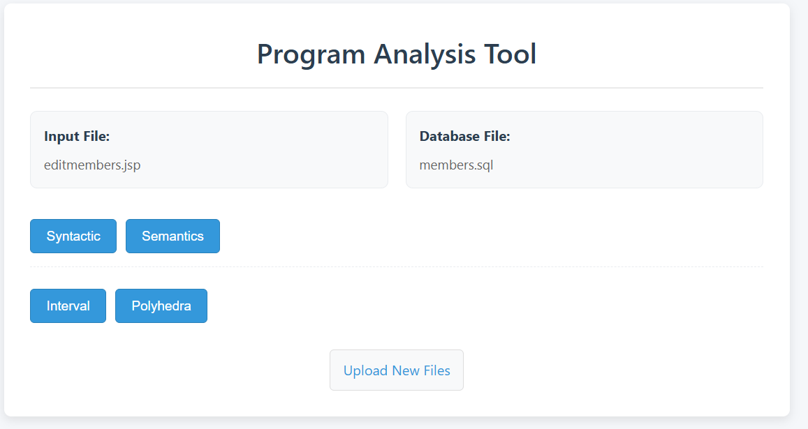
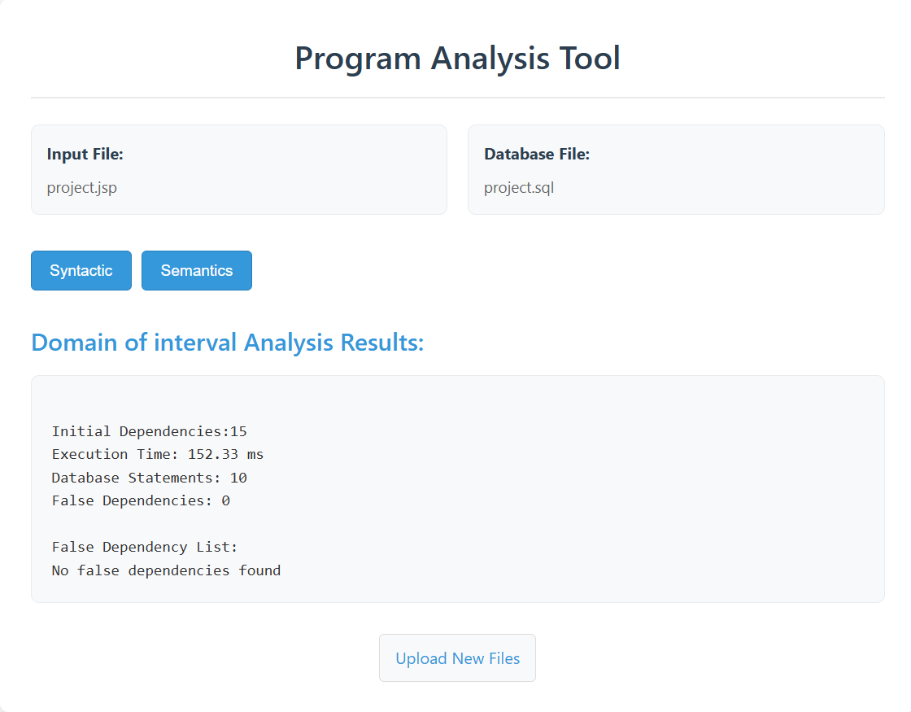
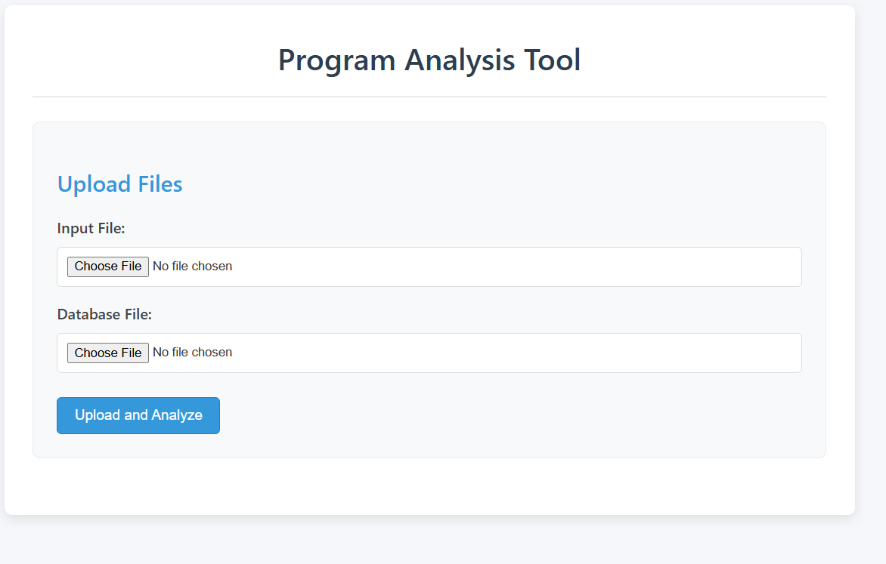

# SemDepA

A comprehensive tool for analyzing dependencies in SQL statements using both syntactic and semantic approaches.

## Overview

This project implements algorithms for detecting and analyzing dependencies in SQL statements. It uses two main approaches:
- **Syntactic Analysis**: Analyzing the structure and grammar of SQL statements
- **Semantic Analysis**: Analyzing the meaning and behavior of SQL statements, further divided into:
  - Domain of Interval Analysis
  - Polyhedra Analysis

## Repository Structure

```
.
├── proformat/        # Code for preprocessing and formatting SQL statements
├── syntax/           # Implementation of syntactic dependency analysis
├── interval/         # Implementation of domain of interval analysis
├── polyhedra/        # Implementation of polyhedra analysis
├── tuning/           # Parameters and configurations for optimizing algorithms
└── images/           # Output visualizations and result examples
```

## Algorithms

### Syntactic Analysis

The syntactic analysis parses SQL statements to identify dependencies based on grammar rules and statement structure. It identifies relationships between tables, columns, and other SQL elements without considering the actual data or query execution.

### Semantic Analysis

Semantic analysis examines the meaning and behavior of SQL statements, considering how data is actually processed during query execution.

#### Domain of Interval Analysis

This algorithm analyzes numerical constraints and relationships in SQL statements by tracking intervals of possible values. It helps identify implicit dependencies that may not be apparent from syntax alone.

#### Polyhedra Analysis

A more sophisticated semantic approach that models query constraints as polyhedra (geometric objects with flat sides) in multi-dimensional space. This allows for precise dependency analysis even in complex query conditions.

## Getting Started

### Prerequisites

[List any prerequisites like Python version, database systems, etc.]

### Installation

```bash
git clone https://github.com/yourusername/sql-dependencies-analyzer.git
cd sql-dependencies-analyzer
# Add installation steps
```
-----------------------------------------------------------------------------

## TOOL USAGE:

### Step 1: Upload Input & DB File 



### Step 2: View Syntactic Analysis



### Step 3: Select an algorithm between interval and polyhedra by clicking on semantics 



### Step 4: View Semantic(Domain Of Interval) Analysis



### Step 5: View Semantic (Polyhedra) Analysis




## Configuration

The `tuning/` directory contains parameters for configuring and optimizing the algorithms for different SQL dialects and scenarios.

## Contributing

Contributions are welcome! Please feel free to submit a Pull Request.

## References

1. P. Cousot and R. Cousot. Abstract interpretation: a unified lattice model for static analysis of programs by construction or approximation of fixpoints. Presented at the Symposium on Principles of Programming Languages (POPL), ACM Press, pages 81–92, 1977.

2. D. Willmor, S. M. Embury, and J. Shao. Program slicing in the presence of a database state. In Proceedings of the 20th International Conference on Software Maintenance, pages 448–452, 2004.

3. I. Mastroeni and D. Zanardini. Data dependencies and program slicing: from syntax to abstract semantics. In Proceedings of the ACM Symposium on Partial Evaluation and Semantics-Based Program Manipulation (PEPM), pages 125–134, 2008.

4. R. Halder and A. Cortesi. Abstract interpretation of database query languages. Computer Languages, Systems & Structures, Volume 38, pages 123–157, 2012.

5. P. Cousot and N. Halbwachs. Automatic discovery of linear restraints among variables of a program. In Proceedings of the Symposium on Principles of Programming Languages (POPL), pages 84–96, 1978.

6. F. Logozzo. Class invariants as abstract interpretation of trace semantics. Computer Languages, Systems & Structures, Volume 35, pages 100–142, 2003.


THANK YOU...
